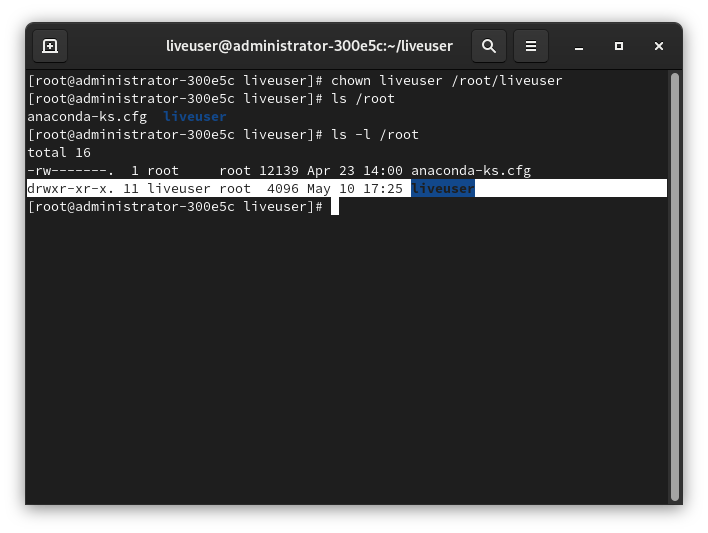
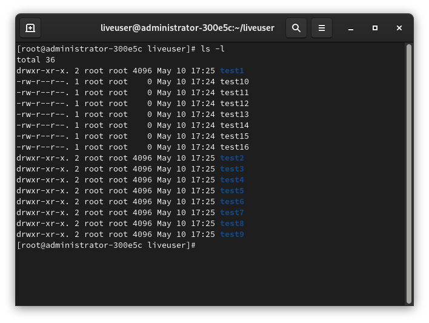
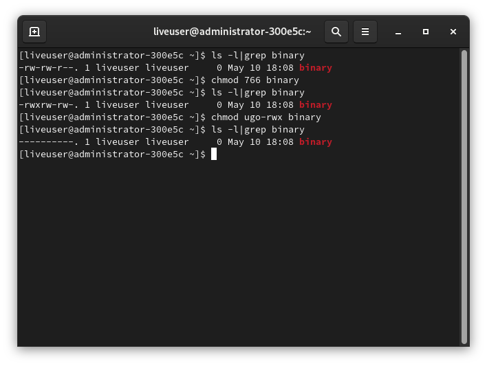

# Строение Linux - часть 3. Права доступа.

Во второй части речь была про концепцию "всё есть файл" и типы файлов, поэтому в этой части статьи будет рассказано про права доступа к файлам.

## История
В отличии от DOS и подобных систем, Unix проектировался как многопользовательская ОС. Поэтому в Unix должна быть хорошая система управления доступа к файлам. А Linux - *Unix-подобное* ядро, поэтому и управление доступом было взято именно из Unix.

## Теория
Чтобы получить доступ к определённому файлу в Linux, используются разрешения, которые назначаются трём объектам: *файлу*, *группе* и другому объекту (т.е. всем остальным). Но перед этим нужно знать про владельца файла (директории не упоминаются специально, так как это тоже файл - концепция "Всё есть файл" в UNIX-подобных/образных).

В Linux у каждого файла есть два владельца: пользователь и группа. Они устанавливаются при создании файла. Каждый файл имеет три категории пользователей, для которых можно устанавливать различные сочетания прав доступа:
* **Владелец** - набор прав для владельца файла - пользователя, который создал его или сейчас установлен его владельцем. Обычно владелец имеет все права: `чтение`, `запись` и `исполнение`
* **Группа** - любая группа пользователей, существующая в ОС и привязанная к файлу
* **Остальные** - все пользователи (кроме владельца и юзеров, входящих в группу файла)

> Только пользователь *root* (он же суперпользователь) может работать со всеми файлами независимо от набора их полномочий.

Пользователь, создавший файл, становится его владельцем, так же как и первичная группа, в которую он входит. Чтобы определить, есть ли у вас, как у пользователя, права доступа к файлу, оболочка проверяет владение им. Принцип работы таков:
* Оболочка проверяет, являетесь ли вы владельцем файла, к которому запрашивается доступ. Если владельцем являетесь, то оболочка прекращает проверку и вы получаете разрешения. Если вы не являетесь владельцем, но входите в группу, у которой есть доступ к файлу, то вы получаете доступ к файлу с теми же разрешениями, что и у той группы.
* Если же вы не являетесь ни пользователем, ни владельцем группы, то вы получаете права других пользователей (`other`).

> Каждый пользователь может получить полный доступ к файлу в том случае, если доступ ему разрешён. Либо же, если он является владельцем файла.

Чтобы увидеть пользователя и группу-владельца файла, выполните:
```bash
ls -l
```

Чтобы просмотреть тоже самое, но для конкретного файла:
```bash
ls -l 'FILE'
```

`FILE` замените на нужный файл.


## Изменение владельца файла
Иногда нужно изменить владельца файла. Например, я это часто делал при компиляции LFS. Особенно при выполнении некоторых тестов сборки пакетов, которые выполнять от имени `root` опасно, а от имени менее привилегированного пользователя очень даже кстати.

Для смены владельца используется `chown` - change owner. Синтаксис этой команды очень прост:
```
chown пользователь опции /путь/к/файлу
```

### Ключи и опции chown
* `-c` `--changes` - подробный вывод всех выполняемых операций
* `-v` `--verbose` - описание действий и вывод подробных данных о каждом обработанном файле
* `-R` `--recursive` - рекурсивная обработка всех подкаталогов
* `-f` `--silent` `--quiet` - минимум информации, выводимой на экран, даже сообщения об ошибках
* `--dereference` - изменять права для файла, к которому ведёт символическая ссылка вместо самой ссылки (*по умолчанию*)
* `--no-dereference` `-h` - изменять права симлинков, но оставить неизменными файлы, на которые указывают эти симлинки
* `-L` - переходить по всем симлинкам на каталоги
* `-H` - если передан симлинк на каталог, перейти по нему
* `-P` - не переходить по символическим ссылкам на каталоги (*по умолчанию*)

## Примеры использования chown


Допустим, есть два пользователя: `root` и `liveuser`. В директории `/root` создана поддиректория `/root/liveuser`. Там ещё несколько файлов. Эта поддиректория принадлежит пользователю root, как и все файлы в ней. А надо сделать так, чтобы принадлежала пользователю `liveuser`. Выполнить в терминале:
```bash
sudo chown liveuser /root/liveuser
```

Если вы хотите видеть подробную информацию о проделанном действии, выполните:
```bash
sudo chown -v liveuser /root/liveuser
```



Но вы сменили владельца только для каталога `/root/liveuser`. А все подпапки и другие файлы, которые находятся в нём, всё так же принадлежат пользователю root. В тех подкаталогах ещё какие-то каталоги находятся. Можно, конечно, для каждого файла/каталога изменить владельца персонально, но это утомительно, а в некоторых случаях невозможно вообще. На этот случай у есть ключ `-R`, задающий утилите `chown` рекурсивно обойти все файлы и каталоги, изменив их права:
```bash
sudo chown -R liveuser /root/liveuser/
```

Как вы видите, все файлы из `/root/liveuser` теперь пренадлежат пользователю `liveuser`, а не `root`. Однако, мы сменили только владельца, а не группу файла/ов.

Опять возвращаем всё в то состояние, которое было до экспериментов с `chown`:
```bash
sudo chovn -Rv root /root/liveuser
```

Если вы хотите поменять не только владельца, но и группу файла, то запишите имя пользователя и имя группы через двоеточие:
```bash
sudo chown -v liveuser:liveuser /root/liveuser
```

Теперь измените группу и владельца на `liveuser` только для тех файлов, у которых владелец и группа `root` в каталоге `/root/liveuser/`:
```bash
sudo chown --from=root:root liveuser:liveuser ./
```

## Изменение группы файла
Для изменения группы файла используется команда `chgrp` (*change group*). В отличии от предыдущей описанной команды `chown`, для `chgrp` требуется только имя группы, имя пользователя не нужно.

Синтаксис этой команды очень прост:
```bash
chgrp опции имя_группы /путь/к/директории
```

> Вместо имени группы можно указать её GID (идентификатор группы)

### Ключи и опции chgrp
* `-c` `--changes` - подробно описывать действия для каждого файла, чья группа изменяется
* `-f` `--silent` `--quiet` - не выдавать сообщения об ошибке для файлов, чья группа не может быть изменена
* `-h` `--no-dereference` - работать с символьными ссылками, а не файлами, на которые они указывают. Данная опция доступна, только если используется `lchown`
* `-v` `--verbose` - подробно описывать действие или отсутствие для **каждого** файла
* `-R` - рекурсивно изменить группы для каталогов и их содержимого, а возникающие ошибки не прекратят работу программы
* `-L` (**используется вместе с `-R`**)- для каждого файла, указанного или пользователем, или встреченного при обходе дерева каталогов, если этот файл является симлинком на каталог, изменить группу самогО этого каталога и всех файлов в его иерархии
* `-h` - для каждого файла, являющегося символической ссылкой, изменить группу самой этой ссылки, а не объекта, на который она указывает, а если система не поддерживает группы для симлинков, то ничего не делать.
* `--` - завершение списка опций

## Примеры использования chgrp
Опять же, перед изменением группы-владельца файла, проверьте с помощью `ls` текущую группу:
```bash
ls -l 'ИМЯ_ФАЙЛА'
```

Теперь добавьте некую группу `mygroup`:
```bash
sudo groupadd mygroup
```

И сделайте группу `mygroup` владельцем директории `/root/liveuser`:
```bash
sudo chgrp mygroup /root/liveuser
```

Как и в случае с `chown`, группа стала владельцем только каталога `/root/liveuser`, но не файлов и подкаталогов этой директории. Чтобы изменить группу-владельца файла, можно, конечно, сделать вручную, а можно воспользоваться рекурсивным способом. За это отвечает ключ `-R`:
```bash
sudo chgrp -R mygroup /root/liveuser/
```

Однако, рекурсивный метод не назначает прав на симлинки, поэтому у них сохраняется прежняя группа. Чтобы установить новую группу и на символические ссылки, добавьте ключ `-h`:
```bash
sudo chgrp -Rh mygroup /root/liveuser
```

Для того, чтобы скопировать группу владельцев директории, воспользуйтесь ключом `--reference`:
```bash
sudo chgrp --reference /home/liveuser /root/liveuser
```

## Специальные права доступа к файлам
Для того, чтобы позволить *обычным* пользователям выполнять программы от имени суперпользователя, не зная его пароль, были созданы биты `SUID` и `SGIG`.
* Если установлен бит `SUID`, то при выполнении программы, ID пользователя меняется на ID владельца файла. *Фактически*, это позволяет обычным пользователям запускать программы от имени суперюзера.
* `SGID` работает аналогичным способом, но разница в том, что юзер считается членом группы, с которой связан этот файл, а не групп, которым он действительно принадлежит. Если флаг `SGID` установлен на каталог, все файлы, созданные в нём, будут связаны с группой каталога, а не пользователя. Такое поведение используется для организации общих папок.
* Бит `Sticky-bit` так же используется для создания общих директорий. Когда он установлен, пользователь может только создавать, читать и выполнять файлы, но не может удалять их, если они принадлежат другим пользователям.

Так, например, с помощью специальных прав доступа к файоам вы можете выполнять некоторые команды из `/sbin` и `/usr/sbin` от имени обычного пользователя.

## Права на файлы - условные обозначения.
Опять же, чтобы узнать права на каждый файл, выполните:
```bash
ls -l
```


В первой колонке отображены права на файл. Вот условное обозначение каждого элемента:

| Обозначение | Расшифровка |
|:-----------:|:------------|
| `---` | совсем нет прав |
| `--x` | разрешено только выполнение файла как программы, но не изменение и чтение |
| `-w-` | разрешена только запись и изменение файла |
| `-wx` | разрешено изменение и выполнение, но если это каталог, ещё и просмотр его содержимого |
| `r--` | права только на чтение |
| `r-x` | только чтение и выполнение, но не запись |
| `rw-` | чтение и запись, но не выполнение |
| `rwx` | все права |
| `--s` | установлен `SUID` или `SGID` бит, первый отобпажается в поле для владельца, второй для группы |
| `--t` | установлен `Sticky-bit`, из-за чего пользователи не могут удалить этот файл |

## Примеры использования chmod
Для изменения прав на файл используется `chmod`. Работа с ней такая же простая, как и с предыдущими утилитами. Вот её синтаксис:

```
chmod опции <категория><действие><флаг> файл
```

### Права доступа
В предыдущем разделе написал про права. Продублирую это и здесь, но покороче. Подобная таблица показывает "сокращения", которые используются для `chmod`, отображаются в выводе `ls` или `exa`, etc.

| Обозначение | Расшифровка |
|:-----------:|:------------|
| `r` | чтение (*Read*) |
| `w` | запись (*Write*) |
| `x` | выполнение (*eXecute*) |
| `s` | выполнение от имени *суперпользователя* (*Superuser*) - дополнительный |

И категории пользователей:

| Обозначение | Расшифровка |
|:-----------:|:------------|
| `u` | владелец файла (*User*) |
| `g` | группа файла (*Group*) |
| `o` | все остальные пользователи (*Other*) |

В качестве действий могут использоваться знаки `+` (включить) и `-` (отключить). Вот несколько примеров:

| Обозначение | Расшифровка |
|:-----------:|:------------|
| `u+x`   | разрешить выполнение для владельца |
| `ugo+x` | разрешить выполнение для всех |
| `ug+w`  | разрешить запись для владельца и группы |
| `o-x`   | запретить выполнение для остальных пользователей |
| `ugo+rwx` | разрешить все права для всех пользователей |

Действия так же можно записывать и с помощью цифр. Первая цифра используется для указания прав для пользователя, вторая для группы и третья для всех остальных.

| Числа       | Действие    | Обозначение в буквенном варианте |
|:-----------:|:------------|:--------------------------------:|
| `0` | разрешения отсутствуют | --- |
| `1` | `x` - запуск (выполнение, исполнение) | `--x` |
| `2` | `w` - изменение (запись) | `-w-` |
| `3` | `x+w` - исполнение и запись | `-wx` |
| `4` | `r` - чтение | `r--` |
| `5` | `r+x` - чтение и исполнение | `r-x` |
| `6` | `r+w` - чтение и изменение | `rw-` |
| `7` | `r+w+x` - чтение, изменение и запуск | `rwx` |

Примеры *цифровых* действий:

| Обозначение | Расшифровка |
|:-----------:|:------------|
| `744` | разрешить всё для владельца, а остальным только чтение |
| `755` | всё для владельца, остальным только чтение и запуск (исполнение) |
| `764` | всё для владельца, чтение и запись для группы, только чтение для остальных |
| `777` | всем разрешено всё |

!> И тут очень большая опасность. Будьте осторожны при выполнении `chmod` и `chown`. Например, при выполнении `sudo chmod 777 /` вы, по сути, сломаете систему. Ошибка в вводе аргументов команды может привести к очень неожиданным последствиям.

### Опции и ключи chmod
* `-c` - выводить информацию обо всех изменениях
* `-f` - не выводить сообщения об ошибках
* `-v` - выводить максимум сообщений о ходе работы chmod
* `-R` - рекурсивный метод
* `--reference` - взять маску прав из указанного файла
* `--preserve-root` - не выполнять рекурсивные операции для корня файловой системы

## Примеры работы с chmod
Разрешить выполнение определённого скрипта или бинарника пользователю. Допустим, у нас есть некий ELF файл, который называется `binary`. И его надо сделать исполняемым. Для начала выполните `ls -l |grep binary`, дабы просмотреть его текущие права.
```bash
chmod u+x binary
```

Теперь запускаю его:
```bash
./binary
```

Тоже самое, но с помощью цифр:
```bash
chmod 766 binary
```

А теперь просмотрите, как изменились права на файл:
```bash
ls -l binary
```


А теперь отберите у `binary` все права:
```bash
chmod ugo-rwx binary
```



Файлы с правами 000 недоступны никаким пользователям, кроме суперпользователя и владельца. Вернем права обратно:
```bash
chmod 755 binary
```

Для применения расширенных прав так же используется `chmod`. Нужно указать четырёхзначный аргумент в chmod, первая цифра относится к специальному разрешению, например:
```bash
sudo mkdir binary.d
sudo chmod 2755 binary.d
```
Эта команда добавит разрешение `SGID` на каталог `binary.d`.

### Числовые значение SUID, SGID и Sticky bit
* SUID - `4`
* SGID - `2`
* Sticky bit - `1`

Ну и самое важное:
* SUID - `chmod u+s`
* SGID - `chmod g+s`
* Sticky bit - `chmod +t`


## Ещё немного про SUID, GUID. Понимание важного.
### SUID
Рассмотрим простой пример. Нужно поменять пароль своей учётной записи. Для этого нужно отредактирвоать файл `/etc/shadow`. Но он доступен только суперпользователю. Однако, в утилите `/usr/bin/passwd` разрешение SUID применяется по умолчанию. В этом можно убедиться, просмотрев на этот самый `/usr/bin/passwd`:
```bash
ls -l /usr/bin/passwd
```

При смене пароля пользователь **ВРЕМЕННО** получает права root, что позволяет ему редактировать `/etc/shadow`, ибо есть разрешение `SUID`. Так ведь, если `passwd` именно это и делает? - редактирует нужный файл. Вот в этом и опасность разрешения SUID: с одной стороны, оно, однозначно, полезно и удобно, но довольно опасно. Поэтому пользуйтесь им **с осторожностью**.

### SGID
А теперь второе.

`SGID` - идентификатор группы. SGID даёт пользователю, который исполняет определённый файл, разрешения владельца группы этого файла, что означает, что SGID позволяет выполнить примерно тоже самое, что и SUID. Но, как ни странно, SGID для этой цели если сипользуется, то очень редко, но как в случае с SUID, он применяется к некоторым системным файлам по умолчанию.

Однако, SGID может быть полезен тогда, когда он применяется к каталогу: вы можете использовать его для установки владельца группы по умолчанию для файлов и подкаталогов, созданных в этом каталоге. По умолчанию, когда пользователь создает файл, его эффективная первичная группа устанавливается как владелец группы для этого файла.

### Sticky-bit
И, наконец, третье - `Sticky-bit`. Это разрешение полезно для защиты файлов от *случайного* удаления в среде, где несколько пользователей имеют права на запись в одну и ту же директорию; если применяется закреплённый sticky-bit, пользователь может удалить файл, только если он является пользователем-владельцем файла/каталога, в котором содержится файл. Именно поэтому он применяется, скажем, в `/tmp`.

Без sticky bit, если пользователь может создавать файлы в каталоге, он также может удалять файлы из этого каталога. В общедоступной групповой среде это может раздражать. Представьте себе пользователей linda и lori, которые оба имеют права на запись в каталог /data/account и получают эти разрешения благодаря участию в группе account. Поэтому linda может удалять файлы, созданные lori, и наоборот.

Когда вы применяете sticky bit, пользователь может удалять файлы, только если выполняется одно из следующих условий:
* пользователь является владельцем файла
* пользователь является владельцем директории с этим файлом

Увидеть `sticky-bit` можно, выполнив:
```bash
ls -ld
```

Увидите букву `t` в той позиции, где вы обычно видите разрешение на выполнение для других.

## Практика
Введите в терминале:
```bash
sudo chmod -x /usr/bin/chmod
```

Т.е., вы сняли бит исполнения у chmod. И... Всё. А как вернуть? Чтобы можно было запускать `chmod`? С помощью него же самого не возможно, поэтому рядовой пользователь Linux переустановил бы пакет `coreutils`. Но можно и проще:
```bash
ldd /usr/bin/chmod
sudo /usr/lib64/ld-linux-x86-64.so.2 /usr/bin/chmod ugo+x /usr/bin/chmod

ls -l $(which chmod)
```

Так вы вернули бит исполнения программе `chmod`.

!> Настоятельно не рекомендуем производить подобные эксперименты с другими системными файлами!

## Смотрите также:
* `man chmod`
* `man chown`
* `man ls`
* `man ldd`
